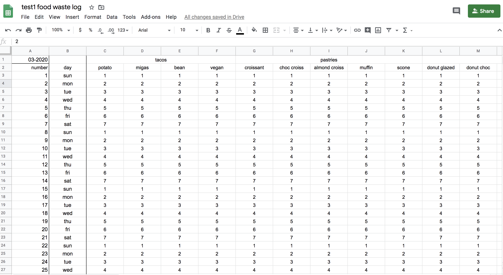
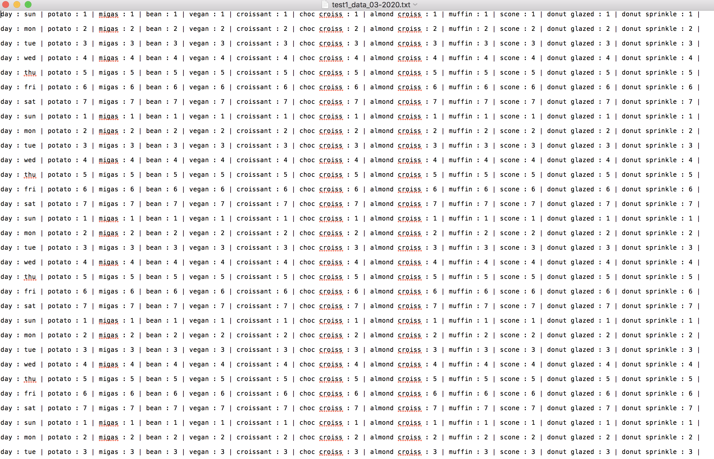
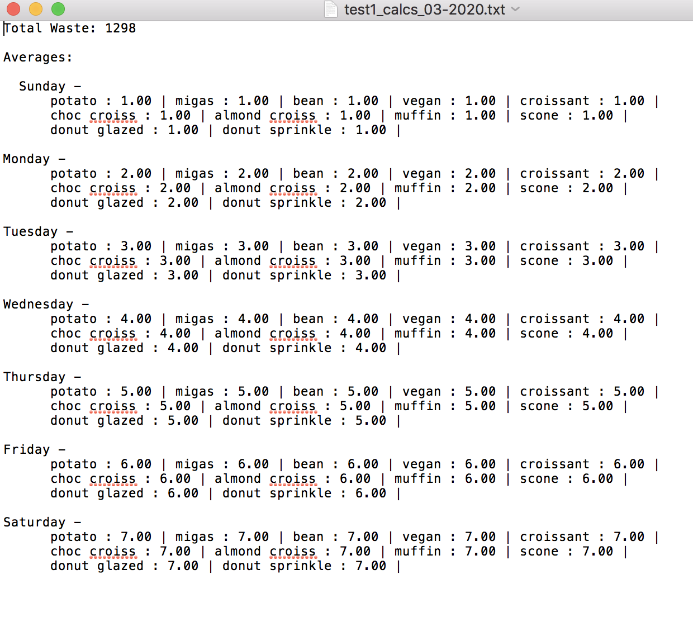

<b>Description</b>

  
A Python application to track food waste and dial in ordering for restaurants. It uses the Google
  Sheets API and runs calculations to get averages for each day’s leftover food items. Files are
  created with the raw data and calculations for the month. The application then resets the Google
  Spreadsheets for the next month with data cells cleared out.

<b>Spreadsheet filled out</b>

<b>Files created with raw data and calculations</b>

<b>Spreadsheet reset for new month, clearing out old data</b>

<b>Sheets For Reference</b>

  
The Google Spreadsheets used for testing: 
  <a href="https://docs.google.com/spreadsheets/d/1oBXPYKTmSMF_yq6YRhqE5N80OLWGAXwCFT0RRcJNk28/edit#gid=0">
  test1 food waste log</a> 
  <a href="https://docs.google.com/spreadsheets/d/1M9qNOIab-WGT0FcifnXJDd6FCSdSnzgWndhGxytsfAc/edit#gid=0">
  test2 food waste log</a>

